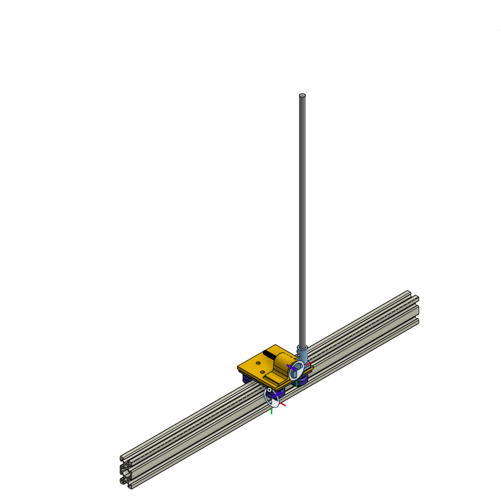
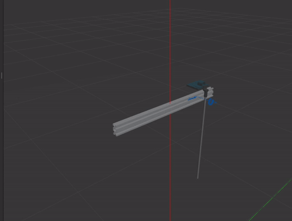

### Inverted pendulum simulation

This repository is my try at simulating the classic inverted pendulum using Gazebo. The simulation uses 3D cad model parts that can be found in [here](https://cad.onshape.com/documents?nodeId=26ceb50092e1f5103518d249&resourceType=folder) and it can be a sort of tutorial how we can use the 3D modelling softwares and create an URDF file for simulation out of them.

